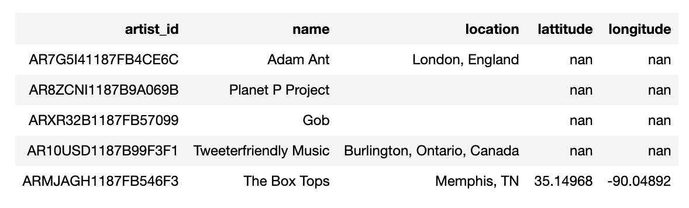
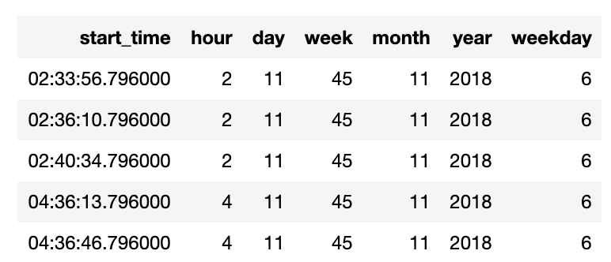

# What is it?
    A startup called Sparkify wants to analyze the data they've been collecting on songs and user activity on their new music streaming app. The analytics team is particularly interested in understanding what songs users are listening to. Currently, they don't have an easy way to query their data, which resides in a directory of JSON logs on user activity on the app, as well as a directory with JSON metadata on the songs in their app.

# Get Started
1. Run `python create_tables.py`
1. Run `python etl.py`
1. Run `test.ipynb` in jupyter

# Screenshots of Tables
## Artists Table

## Songplays Table

## Songs Table

## Time Table

## Users Table

# How it works?
| File               | What to do                                   |
| ------------------ | -------------------------------------------- |
| `data` folder      | testing data                                 |
| `create_tables.py` | drop and create tables                       |
| `etl.py`           | populate sample testing data into database   |
| `sql_queries.py`   | create, drop and insert queries              |
| `test.ipynb`       | connect to db and run test queries           | 

# Database Schema 
    The Schema design follows the dimension design by creating facts and dimension tables.

